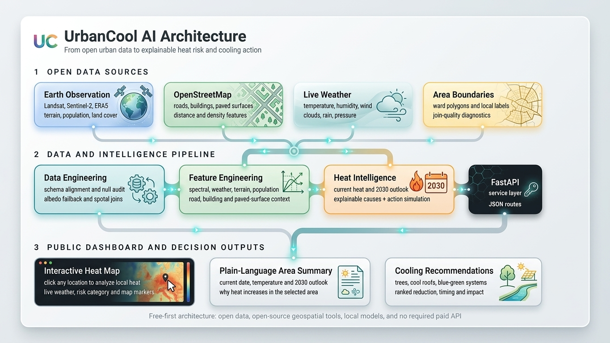
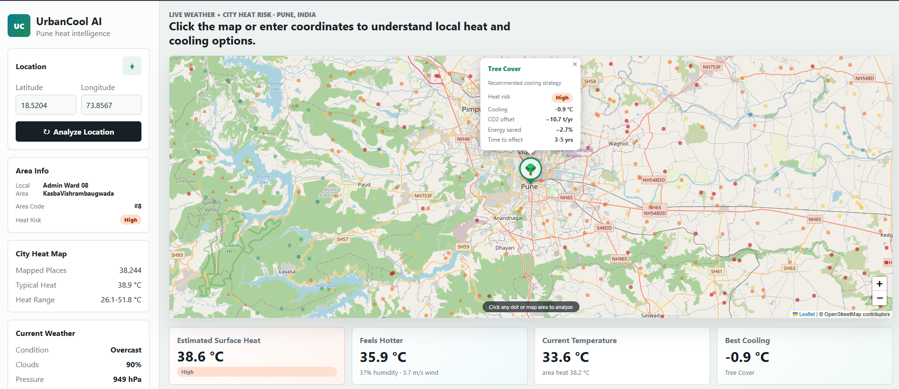
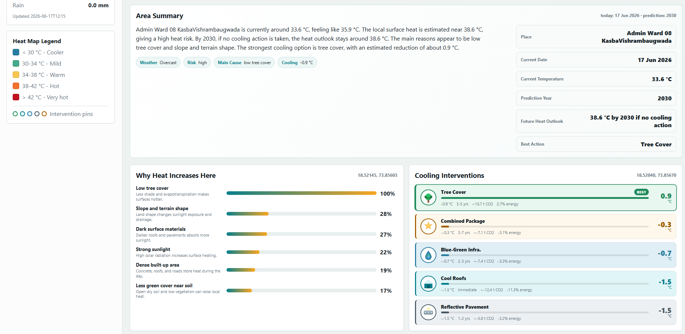

# UrbanCool AI

UrbanCool AI is a free/open-source Pune heat and land-surface-temperature workflow. It combines Earth Engine exports, OSM-derived urban form features, grid-level LST modeling, intervention simulation, ward diagnostics, and a FastAPI backend.

## Project Architecture

UrbanCool AI combines open earth-observation data, OpenStreetMap urban features, live weather, local heat-intelligence models, and a public-facing dashboard.



## Project Outcomes

### Interactive City Heat Map

The map allows users to select a location and view current weather, estimated surface heat, area risk, and the recommended cooling intervention.



### Area Summary and Cooling Recommendations

Each selected area receives a plain-language summary containing current conditions, the 2030 heat outlook, major heat causes, and ranked cooling actions.



## Presentation

The complete hackathon idea proposal, including the problem statement, proposed solution, technology stack, expected impact, roadmap, team details, and supporting diagrams, is available here:

[Download the UrbanCool AI presentation](reports/urbancool-ai.pptx)

Files available in `reports/`:

| File | Description |
| --- | --- |
| [`architecture.png`](reports/architecture.png) | UrbanCool AI system architecture |
| [`outcome1.png`](reports/outcome1.png) | Interactive city heat-map dashboard |
| [`outcome2.png`](reports/outcome2.png) | Area summary and cooling recommendations |
| [`urbancool-ai.pptx`](reports/urbancool-ai.pptx) | Complete hackathon proposal presentation |

## Current Main Pipeline

Run from the project root:

```bash
cd /data/text_segmentation/Sanket/urbancool-ai
python3 data/01_schema_align_and_albedo.py
python3 data/02_add_osm_features.py
python3 data/03_add_ward_join.py
python3 data/04_train_grid_lst_model.py
```

The primary model input is:

```text
data/processed/pune_with_osm_features.parquet
```

The ward file is diagnostic for now because most grid points fall outside the available PMC ward polygons:

```text
data/processed/pune_with_osm_wards.parquet
```

For strict ward analysis, filter to:

```python
df[df["ward_join_method"] == "within"]
```

## Important Outputs

```text
models/grid_lst_model.joblib
models/grid_lst_features.json
data/processed/grid_lst_metrics.json
data/processed/grid_lst_eval_predictions.parquet
```

## API

Install dependencies in your active environment, then start the API:

```bash
pip install -r requirements.txt
./run.sh
```

## Dashboard

After the backend starts, open:

```text
http://127.0.0.1:8000/
```

If port `8000` is busy, start on another port:

```bash
PORT=8001 ./run.sh
```

Then open:

```text
http://127.0.0.1:8001/
```

The dashboard uses local FastAPI model endpoints, free OpenStreetMap tiles through Leaflet, and live current weather from Open-Meteo. No paid map or weather API key is required.

Endpoints:

```text
GET  /health
GET  /v1/heat/current?lat=18.52&lon=73.85
GET  /v1/heat/drivers?lat=18.52&lon=73.85
GET  /v1/weather/current?lat=18.52&lon=73.85
POST /v1/scenario/simulate
GET  /v1/intervention/recommend?lat=18.52&lon=73.85
GET  /v1/intervention/map/pune
GET  /v1/report/ward/{ward_id}/pdf
```

Example scenario request:

```bash
curl -X POST "http://127.0.0.1:8000/v1/scenario/simulate" \
  -H "Content-Type: application/json" \
  -d '{"lat":18.52,"lon":73.85,"intervention":"tree_planting","intensity":1.0}'
```

## Additional Modules

Reusable modules are under:

```text
src/data
src/models
src/optimization
app/backend
```

They are designed to work with the already generated local data files and to fail clearly when optional packages such as `pymoo`, `shap`, `gymnasium`, or `stable-baselines3` are not installed.

## Earth Engine

Use these scripts manually in the Earth Engine Code Editor:

```text
gee/01_pune_city_landsat_sentinel_weather_population_export.js
gee/02_pune_ecostress_lst.js
```

No paid APIs are required by the project plan. OSM comes from Overpass/OpenStreetMap, Earth Engine scripts run in the free Earth Engine environment, and all Python dependencies are open-source.
